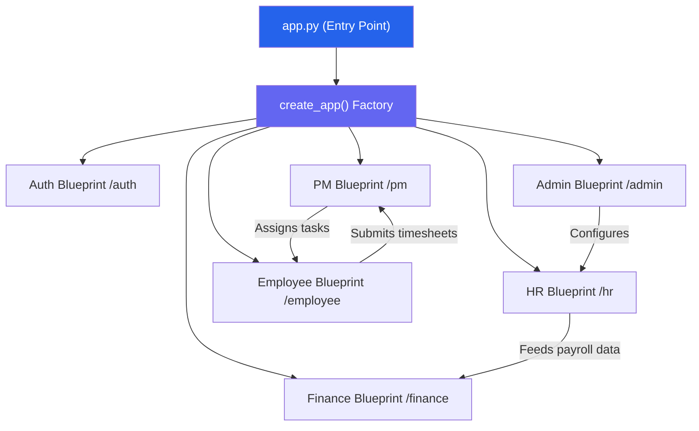
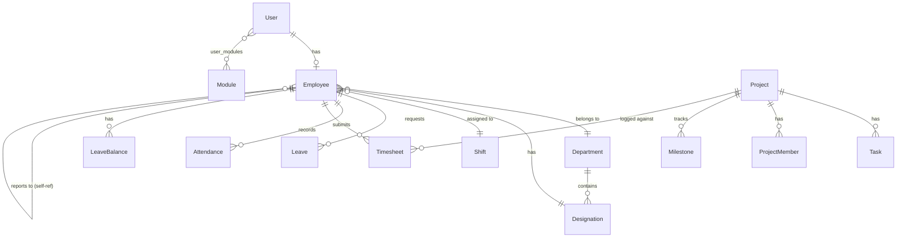

# Enterprise Portal — Application Summary

## Overview

A **full-stack enterprise resource management portal** built with **Python Flask**, designed for internal use by a startup. It provides end-to-end employee lifecycle management across 6 interconnected modules with role-based access control.

---

## Tech Stack

| Layer | Technology |
|---|---|
| **Backend** | Flask 3.1, Python |
| **ORM / Database** | Flask-SQLAlchemy → SQLite (with MySQL-ready config) |
| **Migrations** | Flask-Migrate (Alembic) |
| **Auth** | Flask-Login + Werkzeug password hashing |
| **Forms** | Flask-WTF + WTForms |
| **Email** | Flask-Mail (SMTP/Gmail for password resets) |
| **Frontend** | Jinja2 templates + Bootstrap (server-rendered) |
| **CSRF** | Flask-WTF CSRF protection |

---

## Architecture



Each module follows the pattern:
```
app/<module>/
├── __init__.py     # Blueprint registration
├── routes.py       # Route handlers
├── services.py     # Business logic layer
├── forms.py        # WTForms form classes
└── utils.py        # Helpers (optional)
```

---

## Module Breakdown

### 1. 🔐 Auth Module (`/auth`)
**Purpose:** Authentication & security

| Feature | Details |
|---|---|
| Login | Username/password with case-insensitive lookup |
| Account Lockout | 3 failed attempts → 15-minute lockout |
| Login History | Tracks IP, user-agent, status for every attempt |
| Password Complexity | Min 8 chars, uppercase, lowercase, digit, special char |
| Force Password Change | `must_change_password` flag on first login |
| Forgot Password | AJAX endpoint → generates time-limited token → sends styled HTML email |
| Reset Password | Token-based URL with 30-minute expiry |
| Legacy Hash Migration | Auto-upgrades bcrypt hashes to Werkzeug pbkdf2 on login |

---

### 2. ⚙️ Admin Module (`/admin`)
**Purpose:** System configuration & user management — the "control plane"

| Feature | Details |
|---|---|
| **User CRUD** | Create users with auto-generated temp passwords (`Welcome@XXXX`), edit, activate/deactivate |
| **Module Assignment** | Assign users to modules (HR, PM, Finance, Employee) via many-to-many |
| **Department Management** | Create/edit departments with unique codes |
| **Designation Management** | Role titles tied to departments with levels (1-5: Junior→Head) |
| **Shift Management** | Define shifts (Morning/Afternoon/Night) with start/end times, grace periods, overtime eligibility |
| **Leave Policy Config** | Define leave types (Casual/Sick/Earned) with quotas, carry-forward, encashment, blackout dates; optionally tied to designations |
| **Attendance Rules** | Global config for work hours, late thresholds, half-day/full-day minimums |
| **Holiday Calendar** | Manage company-wide holidays (Public/Restricted/Optional) |
| **Audit Logs** | Full audit trail of all system actions with user, action, entity, IP, timestamp |
| **Login History** | View all login attempts across the system |
| **Profile Update Reviews** | Approve/reject employee-submitted profile changes |

> [!IMPORTANT]
> Admin defines the rules. HR and other modules **consume** these configurations. This separation ensures clean governance.

---

### 3. 👥 HR Module (`/hr`)
**Purpose:** Employee management, attendance, leave, performance, recruitment, payroll prep

#### Employee Management
- Full employee list with search, department filter, status filter (assigned/unassigned)
- Employee detail view with leave balances, recent attendance, recent leaves
- **Onboarding workflow**: Identifies employees with incomplete profiles (missing dept, designation, salary, bank account, PAN, phone) and provides a "Complete Profile" form
- Profile completion tracking with missing field indicators

#### Attendance Management
- **Check-in/Check-out** for employees (HR-side)
- Real-time attendance search API
- Day-wise attendance list with filters (employee, department, status, date range)
- **Monthly attendance report** with summary stats (present, late, absent, half-day, total hours, effective days)
- **CSV export** for both day-wise and monthly reports
- Attendance override capabilities
- **Attendance Regularization**: Review/approve employee requests to correct attendance

#### Leave Management
- View/filter all leave requests by status
- **Two-step approval workflow**: Manager Approval → HR Final Approval
- Leave balance overview per employee per year
- Urgent leave flag (skips manager, goes direct to HR)
- Leave cancellation with balance restoration

#### Performance Management
- Create/edit performance reviews (rating 1-5, strengths, improvements, comments)
- Filter by period (Q1-2026, Annual-2025, etc.) and department

#### Recruitment Pipeline
- **Job Postings**: Create/manage job postings per department with vacancy counts
- **Candidate Tracking**: Applied → Screening → Interview → Offer → Hired/Rejected
- **Interview Scheduling**: Schedule interviews with type (Technical/HR/Managerial), rating, feedback
- Resume upload and management
- Pipeline statistics dashboard

#### Payroll Preparation
- HR generates payroll input data per employee per month
- Working days, present days, leaves taken, overtime hours, bonus, deductions
- Submitted data flows to Finance module

#### Document Management
- Upload employee documents (ID Proof, Offer Letter, Resume, etc.)
- 5MB file size limit, allowed extensions: pdf, doc, docx, jpg, jpeg, png, txt, xlsx, xls

#### Shift & Advanced Features
- Comp-off management (earned from overtime)
- Shift swap request approvals
- Timesheet review and approval

---

### 4. 📊 PM Module (`/pm`)
**Purpose:** Project management, task tracking, milestones, team coordination

| Feature | Details |
|---|---|
| **Projects CRUD** | Create (Admin only), edit (PM/Admin), delete, with unique names and lifecycle states |
| **Project States** | Not Started → In Progress → Completed → On Hold |
| **Auto-completion** | Project auto-marks "Completed" when 100% tasks are Done |
| **Deadline Tracking** | `is_delayed` flag when past deadline but not completed |
| **Team Management** | Add/remove members with roles (Developer, Tester, Designer, Lead, Observer) |
| **Tasks CRUD** | Priority (Low/Medium/High/Critical), status (Pending/In Progress/Done), estimated & actual hours, due dates |
| **Milestones** | Track project milestones with deadlines and overdue detection |
| **Notifications** | Real-time notifications for task assignments, status changes, project delays, milestone completions |
| **Analytics** | Interactive charts with project-level drill-down, hours tracking |
| **Timesheet Approvals** | PM reviews and approves/rejects timesheets submitted by team members |
| **REST API** | Full JSON API for projects, tasks, milestones, members, notifications |
| **RBAC** | Admin sees all, PM sees assigned projects, members see their projects only |

---

### 5. 💰 Finance Module (`/finance`)
**Purpose:** Financial operations — expenses, invoices, salaries

| Feature | Details |
|---|---|
| **Expense Management** | Record, edit, approve/reject company expenses (Travel, Software, Office, Marketing) |
| **Employee Expense Claims** | Review/approve employee-submitted reimbursement claims |
| **Invoice Management** | Create/edit invoices with unique numbers, client names, amounts, due dates, status (Unpaid/Paid/Overdue/Cancelled) |
| **Salary Records** | Create salary records per employee per month with basic, HRA, deductions, net salary |
| **Salary Processing** | Status workflow: Pending → Processed → Paid |
| **Dashboard** | Summary cards for total expenses, pending, total invoiced, unpaid invoices, total salary paid |

---

### 6. 🧑‍💼 Employee Self-Service (`/employee`)
**Purpose:** Employee-facing portal for personal HR interactions

| Feature | Details |
|---|---|
| **Dashboard** | Rich overview with attendance, leave balances, tasks, notifications, timesheet summary, team stats |
| **Profile Management** | Submit profile update requests (name, phone, DOB, bank, PAN, Aadhar, location) → routed to HR for approval |
| **Self Attendance** | Self check-in/check-out with timestamp |
| **Attendance Regularization** | Request corrections for missed/wrong punches → HR approval |
| **Leave Management** | Apply for leave (role-based policy), view balance, urgent leave flag, cancel leaves |
| **Payslips** | View salary records / payslip details (read-only) |
| **Expense Claims** | Submit reimbursement claims with receipt uploads |
| **Documents** | View/download HR-uploaded documents |
| **Performance Reviews** | View performance review history (read-only) |
| **Tasks** | View assigned tasks, update status (Pending → In Progress → Done) |
| **Projects** | View assigned projects and roles |
| **Timesheets** | Submit daily hours against projects/tasks, view history with filters |
| **Notifications** | In-app notification center with mark-read functionality |
| **Analytics** | Personal work analytics with 30-day hourly trend charts, project drill-down |
| **Shift Swap** | Request shift changes → HR approval |
| **Comp-offs** | View earned compensatory offs |
| **Holiday Calendar** | View company holiday calendar (read-only) |
| **My Team** (Managers) | View direct reports, approve/reject team leave requests |

---

## Database Schema — 30+ Models



### Core Models
| Model | Purpose |
|---|---|
| `User` | Authentication, RBAC, profile |
| `Module` | App modules (admin, hr, pm, finance, employee) |
| `UserModule` | Many-to-many user ↔ module assignment |
| `Employee` | HR extension of User (emp_code, salary, bank, PAN, Aadhar, DOB, location) |

### Admin Config Models
| Model | Purpose |
|---|---|
| `Department` | Organizational departments with codes |
| `Designation` | Job titles with levels (1-5), tied to departments |
| `Shift` | Work shifts with timing rules |
| `LeavePolicy` | Leave type definitions with quotas and rules |
| `AttendanceRule` | Global attendance configuration |
| `Holiday` | Company-wide holiday calendar |
| `AuditLog` | System-wide audit trail |
| `LoginHistory` | Login attempt tracking |

### HR / Employee Models
| Model | Purpose |
|---|---|
| `Leave` | Leave requests with two-step approval workflow |
| `LeaveBalance` | Per-employee per-year leave balances |
| `Attendance` | Daily check-in/check-out records |
| `AttendanceRegularization` | Attendance correction requests |
| `ProfileUpdateRequest` | Employee profile change requests |
| `EmployeeDocument` | Uploaded employee documents |
| `PayrollInput` | HR → Finance payroll data bridge |
| `PerformanceReview` | Employee performance evaluations |
| `CompOff` | Compensatory off earned from overtime |
| `ShiftSwapRequest` | Employee shift change requests |
| `EmployeeExpense` | Employee reimbursement claims |

### PM Models
| Model | Purpose |
|---|---|
| `Project` | Projects with lifecycle, deadlines, auto-progress |
| `ProjectMember` | Project team membership with roles |
| `Task` | Project tasks with priority, status, hours |
| `Milestone` | Project milestones with deadline tracking |
| `Notification` | System notifications |
| `Timesheet` | Employee hours logged against project/task |

### Finance Models
| Model | Purpose |
|---|---|
| `Expense` | Company-level expenses |
| `Invoice` | Client invoices |
| `SalaryRecord` | Monthly salary records |

---

## Key Workflows

### 1. Employee Onboarding Flow
```
Admin creates User → System generates temp password & emp_code
→ User logs in → Forced to change password
→ HR completes profile (dept, designation, salary, bank, PAN)
→ Leave balances auto-initialized based on designation policies
```

### 2. Leave Approval (Two-Step)
```
Employee applies for leave
→ IF has reporting manager: Manager approves first (manager_status)
→ HR gives final approval (hr_status)
→ Leave balance deducted
→ IF urgent: Skips manager, goes direct to HR
→ Employee can cancel (approved leaves restore balance)
```

### 3. Timesheet Workflow
```
Employee submits hours → Logs against Project + Task + Date
→ PM reviews on Timesheet Approvals dashboard
→ Approve / Reject with reason
→ Approved hours flow into Task actual_hours
→ HR can also review timesheets
```

### 4. Recruitment Pipeline
```
HR creates Job Posting → Adds Candidates
→ Candidate moves through: Applied → Screening → Interview → Offer → Hired/Rejected
→ Interviews scheduled with rating & feedback
```

---

## Security Features

- 🔒 Password complexity enforcement (8+ chars, upper, lower, digit, special)
- 🔒 Account lockout after 3 failed attempts (15-min cooldown)
- 🔒 CSRF protection on all forms
- 🔒 Force password change on first login
- 🔒 Time-limited password reset tokens (30 min)
- 🔒 Module-based RBAC (`@module_required` decorator)
- 🔒 Admin-only decorator (`@admin_required`)
- 🔒 Full audit logging with IP addresses
- 🔒 Login history tracking (IP, user-agent, status)
- 🔒 Legacy bcrypt → pbkdf2 auto-migration

---

## File Statistics

| Component | File | Lines |
|---|---|---|
| Models | `app/models.py` | 1,034 |
| HR Routes | `app/hr/routes.py` | 1,745 |
| Admin Routes | `app/admin/routes.py` | 1,239 |
| PM Routes | `app/pm/routes.py` | 968 |
| Employee Routes | `app/employee/routes.py` | 949 |
| Auth Routes | `app/auth/routes.py` | 279 |
| Finance Routes | `app/finance/routes.py` | 226 |
| App Factory | `app/__init__.py` | 127 |
| Config | `config.py` | 39 |
| **Total Backend** | | **~6,600+ lines** |
