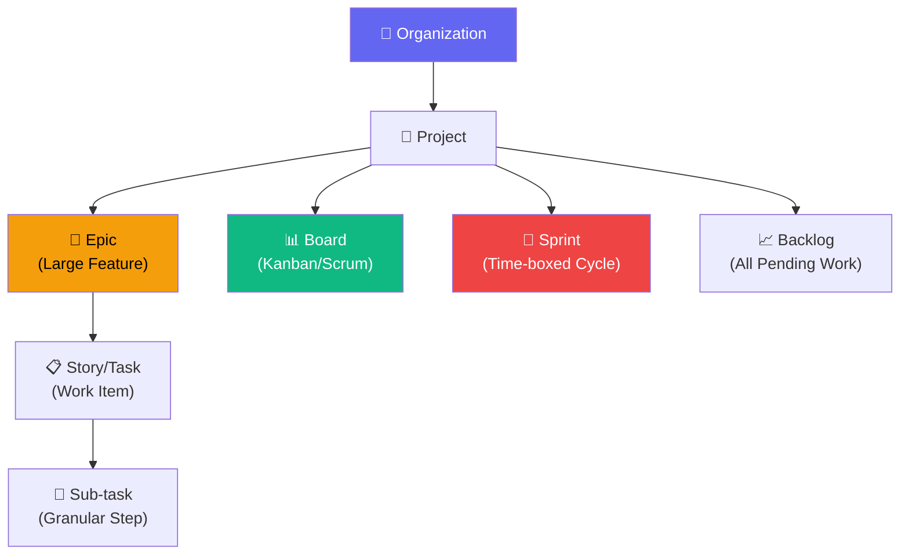
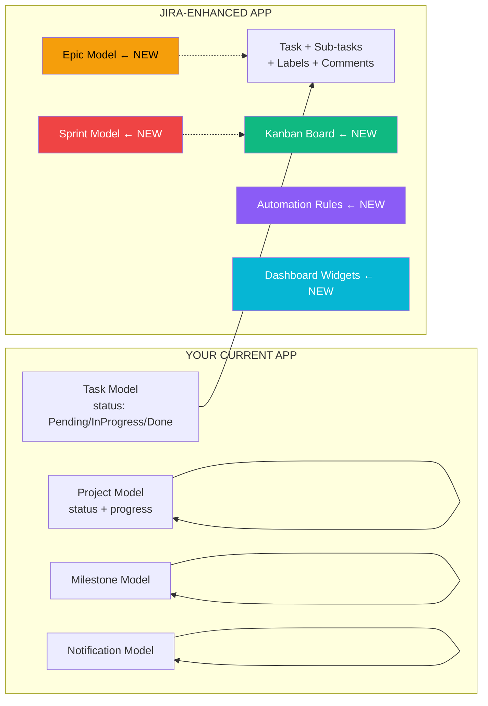

# Employee & Project Management — Standalone App Plan

## 1. Current State Analysis

Your existing enterprise portal has **6 modules** (Auth, Admin, HR, PM, Finance, Employee) tightly coupled in one Flask app. To extract a **standalone Employee + Project Management app**, we need to identify what stays and what gets separated.

### What to Extract

| Keep in Standalone App | Leave Behind (or simplify) |
|---|---|
| Auth (Login, RBAC) | Finance (Invoices, Expenses) |
| Employee Self-Service (Profile, Tasks, Timesheets) | HR Recruitment Pipeline |
| PM Module (Projects, Tasks, Milestones) | Payroll Processing |
| Admin (Users, Departments, Designations) | Salary Records |
| Attendance & Leave Management | Document Management |
| Notifications System | Performance Reviews (optional) |

---

## 2. Jira Software — Feature Breakdown & How to Use It

### What is Jira?

Jira is Atlassian's project management tool used by 65,000+ companies. It organizes work using an **issue hierarchy** and **visual boards**.

### Jira's Core Concepts



### Jira Features vs. Your Current App

| Jira Feature | Your Current App | Gap | Priority |
|---|---|---|---|
| **Epic → Story → Sub-task** hierarchy | Flat tasks only | ❌ No hierarchy | 🔴 High |
| **Kanban Board** (drag-drop columns) | Table-based task list | ❌ No board view | 🔴 High |
| **Sprint Management** (2-week cycles) | No sprint concept | ❌ Missing | 🟡 Medium |
| **Backlog** (prioritized queue) | Tasks created directly | ❌ Missing | 🟡 Medium |
| **Workflow Automation** (auto-transitions) | Manual status updates | ❌ Missing | 🟡 Medium |
| **Filters & JQL** (advanced search) | Basic filtering | ⚠️ Limited | 🟡 Medium |
| **Dashboard Gadgets** (customizable widgets) | Static dashboard | ⚠️ Limited | 🟢 Low |
| **Timeline/Gantt View** | No timeline | ❌ Missing | 🟢 Low |
| **Comments & Activity Log** on tasks | No comments | ❌ Missing | 🔴 High |
| **Labels & Tags** | No labels | ❌ Missing | 🟡 Medium |
| **Watchers** (follow a task) | No watchers | ❌ Missing | 🟢 Low |
| **Burndown/Velocity Charts** | Basic analytics | ⚠️ Limited | 🟡 Medium |

---

## 3. Proposed Architecture — Standalone App

### Option A: Extract from Current App (Recommended)

Keep Flask, reuse existing models/services, strip out Finance/Recruitment/Payroll.

**Pros:** Fastest path, reuse 70% of existing code  
**Cons:** Still server-rendered Jinja2 templates (less interactive)

### Option B: New Frontend + Flask API

Build a modern React/Next.js frontend with your Flask backend as a REST API.

**Pros:** Much more interactive UX (drag-drop boards, real-time updates)  
**Cons:** More development effort, new tech stack to maintain

> [!IMPORTANT]
> **My Recommendation:** Start with **Option A** (extract + enhance) for Phase 1-2, then migrate the PM frontend to a modern JS framework in Phase 3 for Kanban boards and real-time features. This gives you quick wins now while building toward a premium experience.

---

## 4. Phased Implementation Roadmap

### Phase 1 — Foundation & Extraction (Week 1-2)

**Goal:** Clean standalone app with improved UX

#### 1.1 App Separation
- Create new project folder `employee_pm_app/`
- Copy Auth, Admin, Employee, PM modules
- Remove Finance routes, HR recruitment, payroll templates
- Simplify Admin to: Users, Departments, Designations, Shifts, Holidays
- Single `requirements.txt` with only needed dependencies

#### 1.2 UX Improvements — Make It User-Friendly
- **Sidebar Navigation** — Replace top navbar with collapsible sidebar (like Jira's left panel)
- **Breadcrumbs** — `Home > Projects > Project Alpha > Task #42`
- **Quick Actions Bar** — Floating button for "New Task", "New Project", "Log Time"
- **Search Bar** — Global search across projects, tasks, employees
- **Dark/Light Mode Toggle**
- **Responsive Mobile Layout** — Cards instead of tables on small screens

#### 1.3 Task Comments & Activity Log (Jira-inspired)
- New `TaskComment` model (user, task, text, timestamp)
- New `ActivityLog` model (entity, action, user, timestamp)
- Comment thread UI on task detail page
- Auto-logged activities: "John changed status from Pending → In Progress"

---

### Phase 2 — Jira-Inspired PM Features (Week 3-4)

#### 2.1 Issue Hierarchy: Epic → Task → Sub-task

```
New Models:
- Epic (project_id, title, description, status, color_label)
- Task gets: epic_id (FK), parent_task_id (self-ref for sub-tasks), task_type (Story/Bug/Task)
```

**How Jira uses this:**
- **Epic** = "User Authentication System" (spans weeks)
- **Story** = "Implement login page" (days)  
- **Sub-task** = "Design form layout", "Add validation" (hours)

#### 2.2 Kanban Board View

A drag-and-drop board with columns: `To Do | In Progress | In Review | Done`

```
Implementation:
- Use SortableJS library (no framework needed)
- AJAX API to update task status on drop
- Filter by: Assignee, Priority, Epic, Sprint
- Swimlanes by: Epic, Assignee, or Priority
```

#### 2.3 Labels, Tags & Filters
- New `Label` model (name, color) with many-to-many on Tasks
- Labels like: `frontend`, `backend`, `bug`, `urgent`, `design`
- Advanced filter panel: status + priority + assignee + label + date range

#### 2.4 Sprint Management
- New `Sprint` model (project_id, name, start_date, end_date, goal, status)
- Sprint planning: drag tasks from Backlog → Sprint
- Sprint board view (filtered Kanban for active sprint)
- Sprint completion with carry-over of incomplete tasks

---

### Phase 3 — Advanced Features (Week 5-6)

#### 3.1 Workflow Automation (Jira-style Rules)
```
Examples:
- When all sub-tasks → Done, auto-set parent task → Done
- When task assigned → Send notification + Slack/email
- When task overdue → Auto-set priority to Critical
- When PR merged → Move task to "In Review"
```

#### 3.2 Dashboard Widgets (Customizable)
- **My Open Tasks** — personal task list sorted by priority
- **Sprint Burndown Chart** — hours remaining vs. ideal line
- **Team Workload** — bar chart showing tasks per person
- **Project Health Cards** — on-track/at-risk/delayed indicators
- **Recent Activity Feed** — timeline of team actions

#### 3.3 Timeline/Gantt View
- Horizontal bar chart showing task durations
- Dependency arrows between tasks
- Use a library like `frappe-gantt` (lightweight, no framework needed)

#### 3.4 Burndown & Velocity Charts
- **Burndown:** Story points/tasks remaining per day in a sprint
- **Velocity:** Average tasks completed per sprint over time

---

## 5. New Database Models Summary

| Model | Purpose | Jira Equivalent |
|---|---|---|
| `Epic` | Large feature grouping | Epic |
| `Sprint` | Time-boxed iteration | Sprint |
| `Label` | Color-coded tags | Label |
| `TaskLabel` | Many-to-many join | — |
| `TaskComment` | Discussion on tasks | Comment |
| `ActivityLog` | Auto-tracked changes | Activity Stream |
| `WorkflowRule` | Automation triggers | Automation Rules |
| `BoardConfig` | User's board preferences | Board Configuration |

---

## 6. UX/UI Improvements for User-Friendliness

### Navigation (Jira-inspired Sidebar)

```
┌─────────────────────────────────────────────┐
│ 🏠 [Logo]  Employee & PM App         [🔍]  │
├──────────┬──────────────────────────────────┤
│ 📊 Dash  │                                  │
│ 📁 Proj  │   [Main Content Area]            │
│ 📋 Board │                                  │
│ 🏃 Sprint│   - Kanban Board                 │
│ 📑 Backlog│   - Task Details                │
│ ───────  │   - Analytics Charts             │
│ 👤 My Work│                                 │
│ ⏱ Time   │                                  │
│ 📅 Leave │                                  │
│ 🔔 Notif │                                  │
│ ⚙ Settings│                                 │
└──────────┴──────────────────────────────────┘
```

### Key UX Principles
1. **3-Click Rule** — Any action reachable in ≤3 clicks
2. **Inline Editing** — Click a task title/status to edit in-place (no page reload)
3. **Keyboard Shortcuts** — `C` = Create task, `B` = Board view, `/` = Search
4. **Toast Notifications** — Non-blocking success/error messages
5. **Empty States** — Helpful prompts when no data ("No tasks yet. Create your first task →")
6. **Bulk Actions** — Select multiple tasks → change status, reassign, delete

---

## 7. How Jira Features Map to Your App's Code

### Current → Enhanced Mapping



---

## 8. Tech Stack for Standalone App

| Layer | Current | Enhanced |
|---|---|---|
| Backend | Flask + SQLAlchemy | Same (proven & stable) |
| Database | SQLite | PostgreSQL (for production) |
| Frontend | Jinja2 + Bootstrap | Jinja2 + Bootstrap 5 + **SortableJS** (for drag-drop) |
| Charts | Basic JS | **Chart.js** or **ApexCharts** |
| Gantt | None | **frappe-gantt** |
| Real-time | None | **Flask-SocketIO** (for live board updates) |
| Search | SQL LIKE | **Flask-WhooshAlchemy** or JS client-side |

---

## Open Questions

> [!IMPORTANT]
> 1. **Separation Strategy:** Do you want a completely new codebase, or a fork of the current app with modules removed?
> 2. **Frontend Preference:** Are you comfortable staying with Jinja2 templates + JS enhancements, or do you want to learn React/Vue for a more modern frontend?
> 3. **Priority Features:** Which Jira features excite you most? (Kanban board? Sprints? Epics? Automation?)
> 4. **Deployment:** Will this run alongside the existing app, or replace it?
> 5. **Team Size:** How many people will use this? (Affects whether we need real-time features like WebSockets)

---

## Verification Plan

### Phase 1 Validation
- All existing Employee + PM functionality works in the new standalone app
- Navigation is intuitive (sidebar, breadcrumbs, search)
- Task comments and activity logs display correctly

### Phase 2 Validation
- Kanban board drag-drop updates task status via API
- Epics group tasks correctly
- Sprint planning workflow functions end-to-end

### Phase 3 Validation
- Automation rules fire correctly on task state changes
- Dashboard widgets render real-time data
- Burndown charts calculate correctly from sprint data
