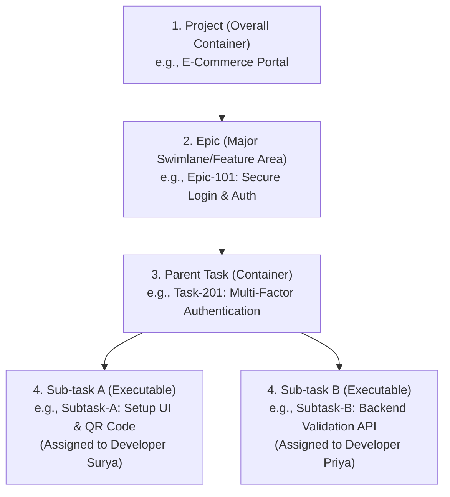

# Project Hierarchy and Automatic Cascading: Testing Guide
This guide provides a comprehensive, step-by-step testing procedure to verify the **Jira-style task management hierarchy** and the newly implemented **auto-propagation (cascading) status and hour logic** in the Enterprise Portal.

You can share this document with your **Team Lead** to demonstrate the architectural integrity, exact database relationships, and complete user validation flows for the project hierarchy.

---

## 1. Core Architecture & Hierarchy Design

The system implements a structured 4-tier hierarchy for projects, modeled as follows:



### The Roles & Rules of Hierarchy

| Element | Description | Execution / Assignment Rules |
| :--- | :--- | :--- |
| **Project** | The topmost container | Managed by PM. Tracks overall progress based on task completion. |
| **Epic** | A large body of work | Can contain both standalone Tasks and Parent Tasks. Progress and status auto-recalculate from the tasks below it. |
| **Parent Task** | A container task | **Crucial Principle:** Parent tasks represent a unified package of work and are not assigned to a single developer. They hold the sum of their subtasks' hours. |
| **Sub-task** | An executable unit | Assigned to individual developers (e.g., Surya, Priya). These are the files where work is marked done and actual hours are logged. |

---

## 2. Automatic Cascading (Status & Hour Propagation)

The application has been upgraded with automated backend hooks. When developers update their **Sub-tasks**, the system automatically propagates updates upward to the **Parent Task** and **Epic**:

```
[Sub-tasks Done] ───► [Parent Task Auto-Completes] ───► [Epic Progress & Status Updates]
[Sub-task Hours Logged] ───► [Sum Aggregated on Parent Task] ───► [Epic Hours Recalculate]
```

### Cascading Rules Matrix:
1. **Hour Aggregation**: Both `estimated_hours` and `actual_hours` from sub-tasks are summed up and stored on their parent task.
2. **Auto-Complete Parent**: When **ALL** sub-tasks under a parent task are marked `Done`, the Parent Task is automatically set to `Done`.
3. **Auto-Revert Parent**: If a parent task is `Done`, and any sub-task is moved back to `In Progress` or `Pending`, the parent task automatically reverts to `In Progress`.
4. **Auto-Start Parent**: If a parent task is `Pending`, and any sub-task moves to `In Progress`, the parent task automatically moves to `In Progress`.
5. **Epic Progress & Status**: The Epic’s progress percentage (`progress`) counts both direct tasks and all sub-tasks under them. Epic status automatically adjusts to:
   - `Done` if all tasks under it are `Done`.
   - `In Progress` if at least one task under it is `In Progress` or `Done` (but not all are done).
   - `To Do` if all tasks under it are `Pending`.

---

## 3. Step-by-Step Test Procedure (with Example Scenario)

To verify all modules (Project Management, Employee Services, Timesheets, and Audit Logs), use this comprehensive walkthrough.

### Test Scenario Setup:
- **Project Manager**: `PM User` (e.g., Admin/PM)
- **Employee A**: `Surya` (User ID 15)
- **Employee B**: `Priya` (User ID 16)
- **Project**: `User Authentication Portal`
- **Epic**: `Epic-101: Secure Login & Profile`
- **Parent Task**: `Task-201: Multi-Factor Authentication (MFA)` (Container)
- **Sub-task A**: `Subtask-201A: Design MFA Setup & QR Code Page` (Assigned to Surya, 4 Hours Estimate)
- **Sub-task B**: `Subtask-201B: Backend MFA Validation API` (Assigned to Priya, 8 Hours Estimate)

---

### Phase 1: Project & Hierarchy Creation (PM Role)

> [!NOTE]
> In this phase, we establish the project structure, define the Epic, create the parent task, and distribute the executable sub-tasks.

1. **Log in as the Project Manager (PM)**.
2. **Create the Project**:
   - Go to `/projects/add` (or click **New Project**).
   - Name: `User Authentication Portal`
   - Select PM: (Assign to yourself)
   - Click **Save**.
3. **Add Project Members**:
   - In the Project Details page, locate **Members** and click **Add Member**.
   - Add `Surya` (Role: Developer).
   - Add `Priya` (Role: Developer).
4. **Create the Epic**:
   - Navigate to `/projects/<project_id>` and scroll to **Epics**.
   - Click **Add Epic**.
   - Title: `Epic-101: Secure Login & Profile`
   - Click **Save**.
5. **Create the Parent Task**:
   - Click **Add Task** inside the project.
   - Title: `Task-201: Implement Multi-Factor Authentication (MFA)`
   - Epic: Select `Epic-101: Secure Login & Profile`
   - Task Type: `Task` (or `Story`)
   - Assigned To: *Leave Unassigned* (since it is a parent container task)
   - Click **Save**.
6. **Create the Sub-tasks**:
   - Click **Add Task** again to create the first subtask:
     - Title: `Subtask-201A: Design MFA Setup & QR Code Page`
     - Epic: Select `Epic-101`
     - Parent Task: Select `Task-201: Implement Multi-Factor Authentication (MFA)`
     - Task Type: `Sub-task`
     - Assigned To: `Surya`
     - Estimated Hours: `4.0`
     - Click **Save**.
   - Click **Add Task** again to create the second subtask:
     - Title: `Subtask-201B: Backend MFA Validation API`
     - Epic: Select `Epic-101`
     - Parent Task: Select `Task-201: Implement Multi-Factor Authentication (MFA)`
     - Task Type: `Sub-task`
     - Assigned To: `Priya`
     - Estimated Hours: `8.0`
     - Click **Save**.

#### Verification Checklist (PM Board/Details View):
* [ ] **Parent Task Hour Aggregation**: In the project details, the Parent Task `Task-201` should show an Estimated Hours sum of **12.0 hours** (4.0 + 8.0), even though you didn't define hours directly on the parent.
* [ ] **Epic Status**: The Epic shows `To Do` and Progress is `0%`.

---

### Phase 2: Execution & Sub-task progress (Developer Surya)

> [!NOTE]
> In this phase, Surya logs into his dashboard, starts work on his sub-task, logs hours through timesheets, and completes his task.

1. **Log in as Developer Surya**.
2. **Start the Sub-task**:
   - Go to `/employee/tasks` (My Tasks).
   - Locate `Subtask-201A: Design MFA Setup & QR Code Page` (Status: `Pending`).
   - Click **Start Work** (or change status to `In Progress`).
   
   *🔍 **Backend Verification**: Log in as PM or look at `/projects/<project_id>/board` — both the Sub-task A AND the Parent Task `Task-201` are now automatically in `In Progress` status!*

3. **Log Hours / Submit Timesheet**:
   - Go to `/employee/timesheets/submit` (or click **Log Timesheet**).
   - Date: Select Today
   - Project: `User Authentication Portal`
   - Task: Select `Subtask-201A: Design MFA Setup & QR Code Page`
   - Hours Worked: `4.0`
   - Description: `Designed CSS grid, QR-code canvas, and setup responsive CSS layout.`
   - Click **Submit**.

4. **Complete the Sub-task**:
   - Go back to `/employee/tasks`.
   - Update `Subtask-201A` status to `Done`.

#### Verification Checklist (Intermediary State):
* [ ] **Sub-task Status**: `Subtask-201A` is `Done`.
* [ ] **Parent Task Status**: `Task-201` remains `In Progress` (since `Subtask-201B` is still pending/unstarted).
* [ ] **Epic Status**: `Epic-101` is `In Progress` (Progress is 33%, i.e., 1 out of 3 tasks done).

---

### Phase 3: Timesheet Approval & Hour Propagation (PM Role)

> [!IMPORTANT]
> The PM must review and approve logged timesheets. Actual hours are only populated on the tasks once the PM approves the timesheet.

1. **Log back in as the Project Manager**.
2. **Approve Surya's Timesheet**:
   - Go to `/pm/timesheet-approvals` (Timesheet Approvals).
   - Locate the pending entry from **Surya** for `4.0 hours` under `Subtask-201A`.
   - Click **Approve**.
3. **Verify the Hours Cascade**:
   - Go to the project details page `/projects/<project_id>`.
   - Look at `Subtask-201A`: It now shows **4.0 Actual Hours** (100% of estimate).
   - Look at the parent task `Task-201`: It shows **4.0 Actual Hours**! The hour has successfully cascaded upwards to the parent container.

---

### Phase 4: Completing the Epic (Developer Priya)

> [!NOTE]
> Priya will now complete the second sub-task. Once done, the parent task and Epic will auto-complete.

1. **Log in as Developer Priya**.
2. **Start & Complete Sub-task**:
   - Go to `/employee/tasks`.
   - Locate `Subtask-201B: Backend MFA Validation API`.
   - Change status to `In Progress`.
   - Submit a timesheet for **8.0 hours** worked on `Subtask-201B`.
3. **Mark Done**:
   - Mark `Subtask-201B` status to `Done`.

4. **PM Approves Priya's Timesheet**:
   - Log back in as PM.
   - Go to `/pm/timesheet-approvals` and **Approve** Priya's timesheet for `8.0 hours`.

---

### Phase 5: Final Result Verification (The Showcase)

Go to `/projects/<project_id>` or `/projects/<project_id>/board` and verify that the system successfully completed all steps automatically:

```
┌──────────────────────────────────────────────────────────┐
│              FINAL HIERARCHY STATE (DONE)               │
├──────────────────────────────────────────────────────────┤
│ Epic: Secure Login & Profile (100% PROGRESS, status: DONE)│
│    │                                                     │
│    └─► Parent Task: Task-201: Implement MFA (DONE)       │
│           │   (Est: 12.0h, Act: 12.0h)                   │
│           │                                              │
│           ├─► Subtask-201A: Design Setup Page (DONE)     │
│           │      (Est: 4.0h, Act: 4.0h)                  │
│           │                                              │
│           └─► Subtask-201B: Backend Validation (DONE)    │
│                  (Est: 8.0h, Act: 8.0h)                  │
└──────────────────────────────────────────────────────────┘
```

#### Final Checklist for your Team Lead:
* [ ] **Parent Task Auto-Completion**: `Task-201` is marked **Done** without any manual PM or employee intervention.
* [ ] **Parent Hour Summation**: `Task-201` shows **12.0 hours estimated** and **12.0 hours actual** in the UI.
* [ ] **Epic Status**: `Epic-101` automatically changed to **Done** status.
* [ ] **Epic Progress**: `Epic-101` progress shows **100%**.
* [ ] **Audit Trail / Integrity**:
  - Navigate to the logs or database.
  - Review the auto-complete audit records showing exactly when and why the parent task and Epic status were updated automatically.
  - Notifications were successfully sent to parent task owners.

---

## 4. Reversion & Safety Testing (Negative Testing)

To demonstrate the robustness of the system to your Team Lead, test the negative scenario where a subtask is reopened:

1. **Log in as Developer Surya** (or PM).
2. **Reopen a Subtask**:
   - Move `Subtask-201A` from `Done` back to `In Progress`.
3. **Verify the Upward Reversion Cascade**:
   - The Parent Task `Task-201` will automatically revert from `Done` back to `In Progress` status!
   - The Epic `Epic-101` status will automatically revert from `Done` back to `In Progress` status, and progress will drop back to **66%**.
4. This ensures that parent tasks and Epics never stay in a fake "Done" state if an underlying task is re-opened.
